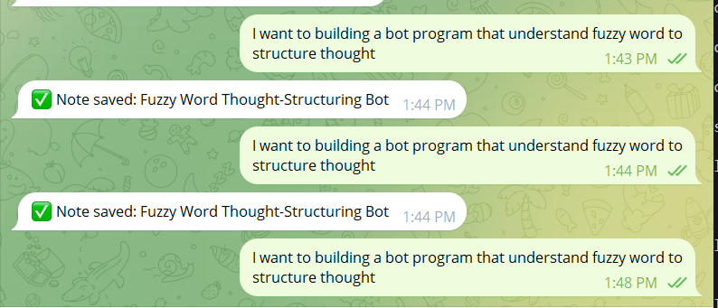
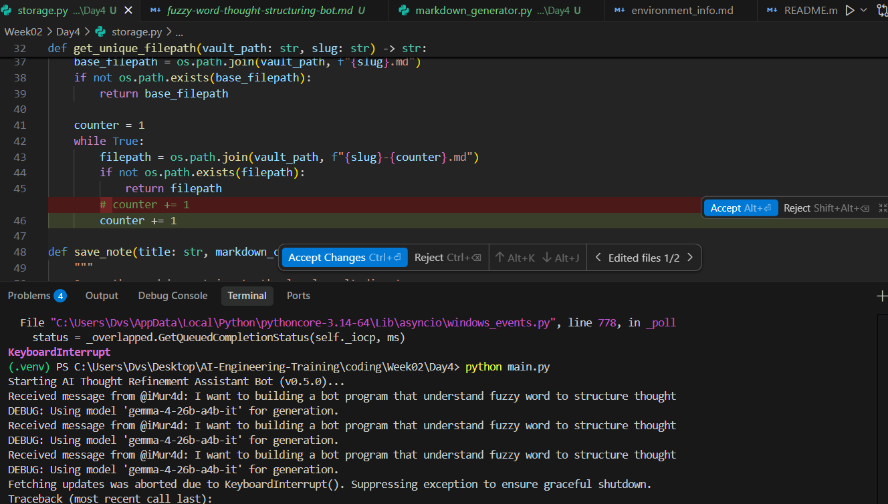
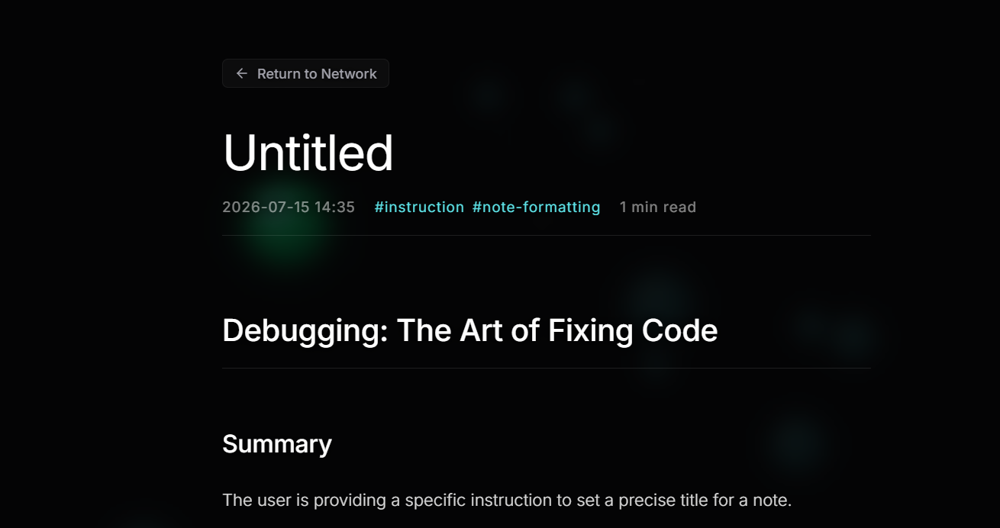
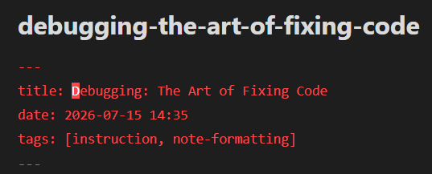
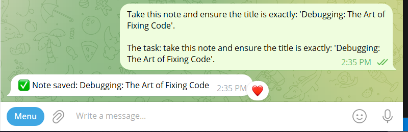
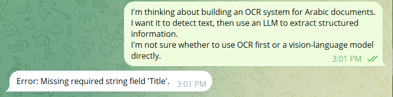
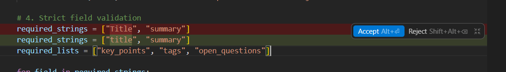

## Bug 1: Infinite loop on repeated filename collisions
### Steps to Reproduce

1. Run the Telegram bot.
2. Send a thought that generates a specific title.
3. Send the same (or a very similar) thought again.
4. Send it a third time.
5. Observe that the bot never replies and no new note is saved.

**Symptom:** Sending the same/similar thought 3 times in a row: the
1st save succeeds normally (base filename), the 2nd save succeeds with
a "-1" suffix (collision handled correctly once), but the 3rd attempt
never completes (no file is created and no Telegram reply is sent).
The bot appears to hang indefinitely.

**Observed behavior:**
- No Telegram confirmation message.
- No new Markdown file created.
- The bot process remains running but appears stuck.

**Diagnosis:** The issue originated in `storage.py`, inside `get_unique_filepath()`.
The loop condition `while True:` is only exited when a unique filepath is
found, but the increment `counter += 1` is commented out. As a result,
when a filename collision occurs more than once, the counter never
advances, and the loop runs forever without returning or erroring.

**Fix:** Restored the missing:

```python
counter += 1
```

inside the collision loop, allowing the filename counter to advance until
a unique filename is found.

### Introduced Change

For debugging purposes, I intentionally commented out:

```python
counter += 1
```

### Screenshots



----------------------------------------------------

## Bug 2: Invalid YAML Frontmatter Formatting

### Steps to Reproduce

1. Run the Telegram bot.
2. Ask the AI to generate a note with a title such as:
   "Debugging: The Art of Fixing Code".
3. Confirm the bot replies with a success message.
4. Open the generated note in the Knowledge OS interface.

**Symptom:** Telegram confirmed that the note was saved successfully, so
at first I assumed everything worked correctly. However, opening the
generated note in the Knowledge OS interface revealed the title showing
as "Untitled" and the tags/date not displaying properly.

**Observed behavior:**
- Telegram confirmation message received normally, which looked like a
  success at first.
- Opening the note in the Knowledge OS interface showed "Untitled"
  instead of the real title, and the metadata (tags, date) didn't
  render correctly either.

**Diagnosis:** In `markdown_generator.py`, the title field in the YAML
frontmatter wasn't wrapped in quotes. Because the title contained a
colon (`:`), the unquoted colon broke the YAML frontmatter, so the
parser couldn't read the metadata correctly, which is exactly why the
interface showed "Untitled."

**Fix:** Restored the double quotes around the title in the Markdown
template (`title: "{data.get('title', '')}"`), which safely escapes
colons and other special characters inside YAML string values.

### Introduced Change

For debugging purposes, I intentionally removed the quotation marks
around the title field in the YAML frontmatter.

```python
# Original
title: "{data.get('title', '')}"

# Bug introduced
title: {data.get('title', '')}
```

### Verification

Repeated the same test using a title containing a colon. Opened the
Knowledge OS interface again. This time the note displayed correctly
with the proper title, tags, and date, instead of "Untitled." Confirmed
the fix resolved the issue.

### Screenshots

 from the website interface
 from the obisdian notes UI
 from telegrgam chat 
--------------------------------------------------------

## Bug 3: Validator Case-Sensitivity Mismatch

### Steps to Reproduce

1. Run the Telegram bot.
2. Send any valid thought (e.g., an idea about a project).
3. Observe the bot's response.

**Symptom:** I sent a completely normal, valid thought about building an
Arabic OCR system, and instead of getting a structured note back, the
bot immediately replied with "Error: Missing required string field
'Title'." I was confused at first since the thought was clearly valid.

**Observed behavior:**
- The bot never attempted to save a note.
- The rejection happened instantly, on every single valid message I
  tried not just this one.

**Diagnosis:** In `validator.py`, the required string key for the title
was accidentally capitalized as `"Title"`. The LLM correctly outputs
`"title"` (lowercase) per the system prompt, but Python dictionary
lookups are case-sensitive, so checking for `"Title"` against a
dictionary that only has `"title"` always fails.

**Fix:** Changed `"Title"` back to `"title"` in the `required_strings`
list inside `validator.py`.

### Introduced Change

```python
# Original
required_strings = ["title", "summary"]

# Bug introduced
required_strings = ["Title", "summary"]
```

### Verification

Sent the same Arabic OCR thought again after the fix. The bot processed
it correctly this time and replied with a successful save confirmation
instead of the error — confirming the fix worked.

### Screenshots





