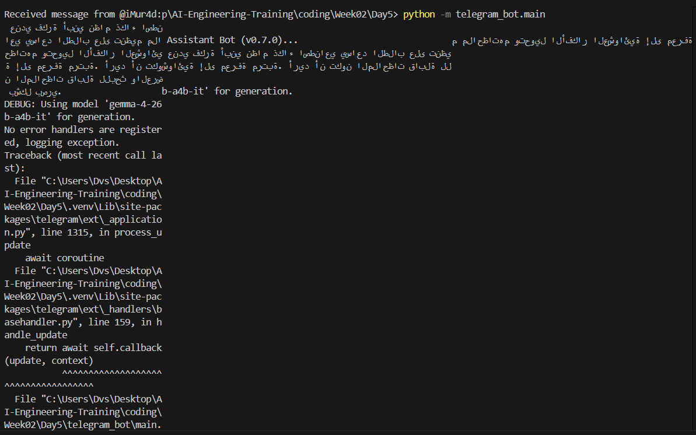
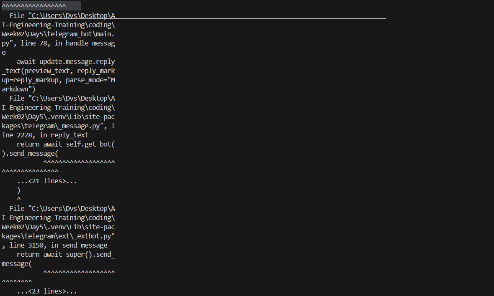
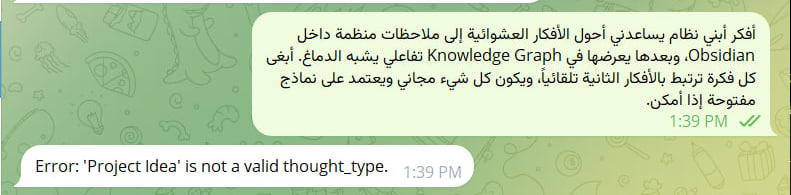
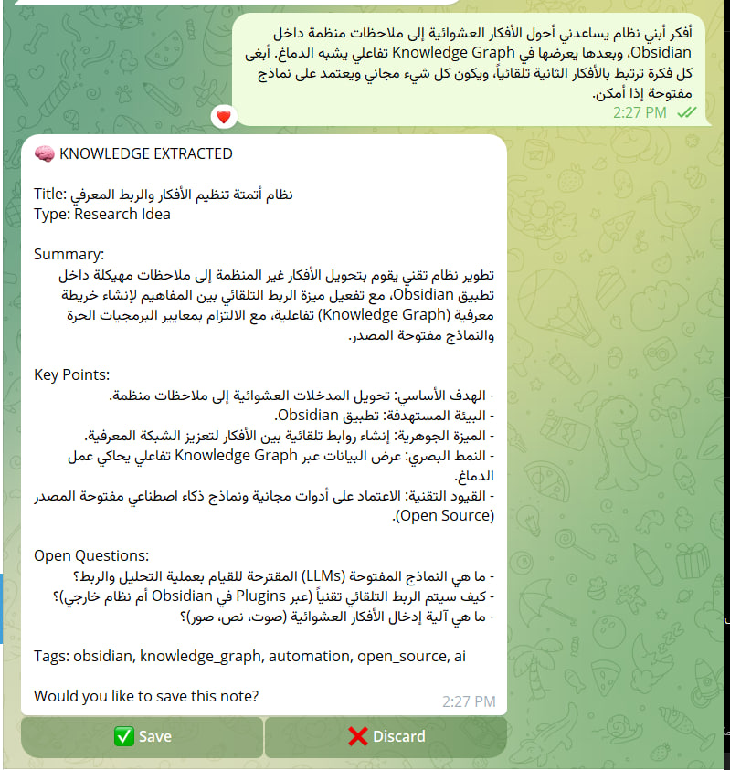

## Bug 1: Telegram preview messages failed when LLM output contained special Markdown characters.

#### Symptom:
Bot crashed with BadRequest: Can't parse entities.

#### Diagnosis:
Telegram Markdown parser interpreted user/LLM-generated characters as formatting syntax.

### Fix:
Removed Markdown parse mode from dynamic LLM-generated messages and switched to safe plain-text formatting.

### Lesson:
When displaying AI-generated content, external parsers should not be trusted unless outputs are sanitized.

``` Received message from @usertelegram:p\AI-Engineering-Training\coding\Week02\Day5> python -m telegram_bot.main عندي فكرة أبني نظام ذكاء اصطناعي يساعد الطلاب على تنظيم ملا Assistant Bot (v0.7.0)...                             م ملاحظاتهم وتحويل الأفكار العشوائية إلى معرفةحظاتهم وتحويل الأفكار العشوائي عندي فكرة أبني نظام ذكاء اصطناعي يساعد الطلاب على تنظية إلى معرفة مرتبة. أريد أن تكوشوائية إلى معرفة مرتبة. أريد أن تكون الملاحظات قابلة للن الملاحظات قابلة للبحث والعرض بشكل بصري.                   b-a4b-it' for generation.
DEBUG: Using model 'gemma-4-26b-a4b-it' for generation.     
No error handlers are registered, logging exception.        
Traceback (most recent call last):
  File "C:\Users\Dvs\Desktop\AI-Engineering-Training\coding\Week02\Day5\.venv\Lib\site-packages\telegram\ext\_application.py", line 1315, in process_update
    await coroutine
  File "C:\Users\Dvs\Desktop\AI-Engineering-Training\coding\Week02\Day5\.venv\Lib\site-packages\telegram\ext\_handlers\basehandler.py", line 159, in handle_update
    return await self.callback(update, context)
           ^^^^^^^^^^^^^^^^^^^^^^^^^^^^^^^^^^^^
  File "C:\Users\Dvs\Desktop\AI-Engineering-Training\coding\Week02\Day5\telegram_bot\main.py", line 78, in handle_message
    await update.message.reply_text(preview_text, reply_markup=reply_markup, parse_mode="Markdown")
  File "C:\Users\Dvs\Desktop\AI-Engineering-Training\coding\Week02\Day5\.venv\Lib\site-packages\telegram\_message.py", line 2228, in reply_text       
    return await self.get_bot().send_message(
           ^^^^^^^^^^^^^^^^^^^^^^^^^^^^^^^^^^
    ...<21 lines>...
    )
    ^
  File "C:\Users\Dvs\Desktop\AI-Engineering-Training\coding\Week02\Day5\.venv\Lib\site-packages\telegram\ext\_extbot.py", line 3150, in send_message  
    return await super().send_message(
           ^^^^^^^^^^^^^^^^^^^^^^^^^^^
    ...<23 lines>...
    )
    ^
  File "C:\Users\Dvs\Desktop\AI-Engineering-Training\coding\Week02\Day5\.venv\Lib\site-packages\telegram\_bot.py", line 
1138, in send_message
    return await self._send_message(
           ^^^^^^^^^^^^^^^^^^^^^^^^^
    ...<21 lines>...
    )
    ^
  File "C:\Users\Dvs\Desktop\AI-Engineering-Training\coding\Week02\Day5\.venv\Lib\site-packages\telegram\ext\_extbot.py", line 638, in _send_message  
    result = await super()._send_message(
             ^^^^^^^^^^^^^^^^^^^^^^^^^^^^
    ...<23 lines>...
    )
    ^
  File "C:\Users\Dvs\Desktop\AI-Engineering-Training\coding\Week02\Day5\.venv\Lib\site-packages\telegram\_bot.py", line 
828, in _send_message
    result = await self._post(             ^^^^^^^^^^^^^^^^^    ...<7 lines>...
    )
    ^
  File "C:\Users\Dvs\Desktop\AI-Engineering-Training\coding\Week02\Day5\.venv\Lib\site-packages\telegram\_bot.py", line 
712, in _post
    return await self._do_post(
           ^^^^^^^^^^^^^^^^^^^^
    ...<6 lines>...
    )
    ^
  File "C:\Users\Dvs\Desktop\AI-Engineering-Training\coding\Week02\Day5\.venv\Lib\site-packages\telegram\ext\_extbot.py", line 378, in _do_post       
    return await super()._do_post(
           ^^^^^^^^^^^^^^^^^^^^^^^
    ...<6 lines>...
    )
    ^
  File "C:\Users\Dvs\Desktop\AI-Engineering-Training\coding\Week02\Day5\.venv\Lib\site-packages\telegram\_bot.py", line 
741, in _do_post
    result = await request.post(
             ^^^^^^^^^^^^^^^^^^^
    ...<6 lines>...
    )
    ^
  File "C:\Users\Dvs\Desktop\AI-Engineering-Training\coding\Week02\Day5\.venv\Lib\site-packages\telegram\request\_baserequest.py", line 198, in post  
    result = await self._request_wrapper(
             ^^^^^^^^^^^^^^^^^^^^^^^^^^^^
    ...<7 lines>...
    )
    ^
  File "C:\Users\Dvs\Desktop\AI-Engineering-Training\coding\Week02\Day5\.venv\Lib\site-packages\telegram\request\_baserequest.py", line 375, in _request_wrapper
    raise exception
telegram.error.BadRequest: Can't parse entities: can't find end of the entity starting at byte offset 1239
```
### Screenshots



-----------------------------------

## Bug 2: LLM generated an unsupported `thought_type`

### Symptom

The bot rejected an otherwise valid user thought and returned the following error:

```
Error: 'Project Idea' is not a valid thought_type.
```

This happened when the user submitted a legitimate project idea such as:

> "أفكر أبني نظام يساعدني أحول الأفكار العشوائية إلى ملاحظات منظمة داخل Obsidian..."

Instead of producing one of the six supported categories, the LLM generated:

```
thought_type = "Project Idea"
```

The validator correctly rejected the response because `"Project Idea"` was not part of the allowed schema.

---

### Diagnosis

The issue was **not in the validator**.

The validator was behaving exactly as intended by enforcing the project's schema.

The real problem was that the **system prompt was too permissive**. Although it listed the allowed categories, it did not strongly instruct the model to use **only** those exact values.

As a result, the LLM invented a new category (`Project Idea`) that sounded semantically reasonable but violated the contract between the LLM and the backend.

This exposed a mismatch between:

- LLM output generation
- Validator expectations

---

### Fix

The system prompt was redesigned to make the output deterministic.

The following improvements were introduced:

- Explicitly stated that `thought_type` **must be exactly one of six predefined values**.
- Added a **CRITICAL CONSTRAINT** section.
- Explicitly prohibited inventing new categories.
- Added a deterministic fallback:

```
If uncertain, use "Observation".
```

- Added a Quality Check section requiring the model to verify its output before returning JSON.
- Improved instructions to organize knowledge rather than summarize text.

After these changes, the same input was consistently classified as:

```
Research Idea
```

which is one of the six valid categories.

---

### Lesson Learned

A strict backend validator alone is not sufficient.

The LLM prompt and the validation schema must define **exactly the same contract**.

When using structured JSON outputs, every allowed enum value should be explicitly constrained inside the system prompt to prevent the model from inventing plausible but invalid categories.

This significantly improves reliability across different LLM providers and model sizes.

### Screenshots
 Before edititg system prompt
 After edititg system prompt
