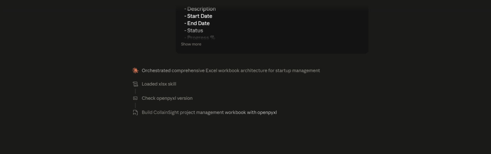
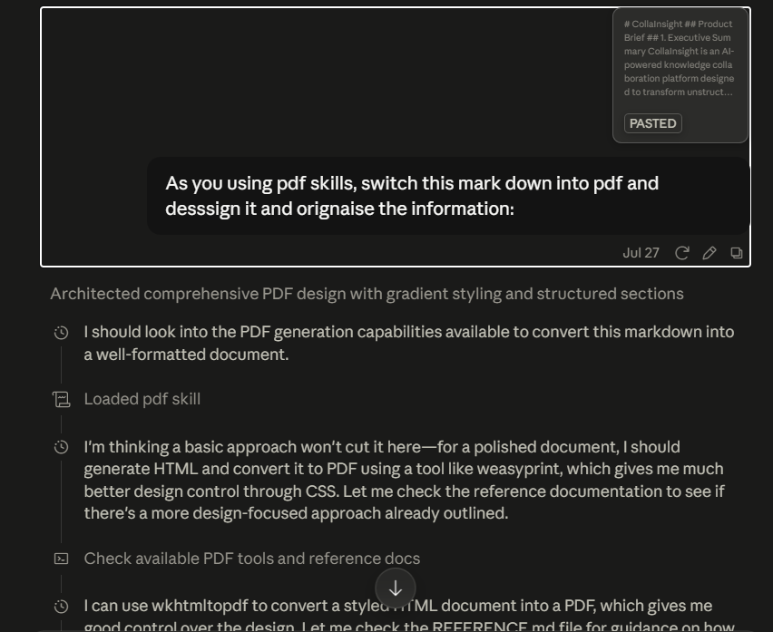
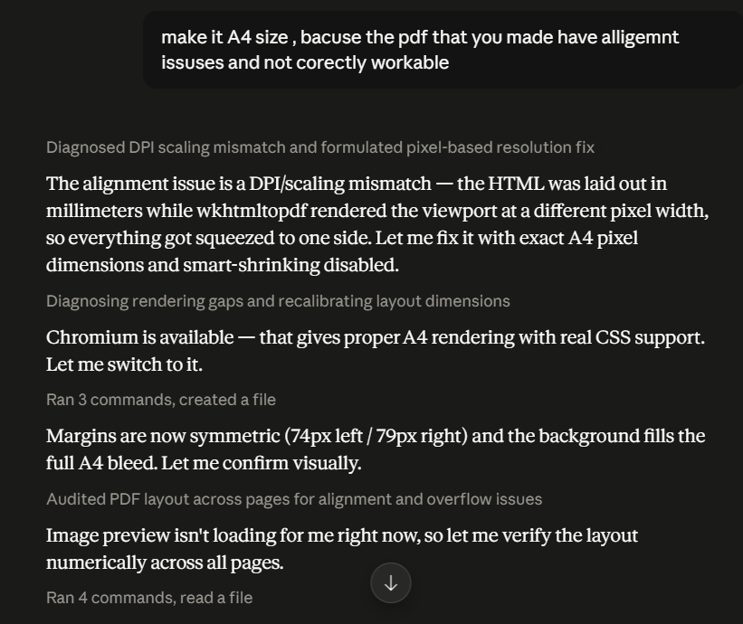
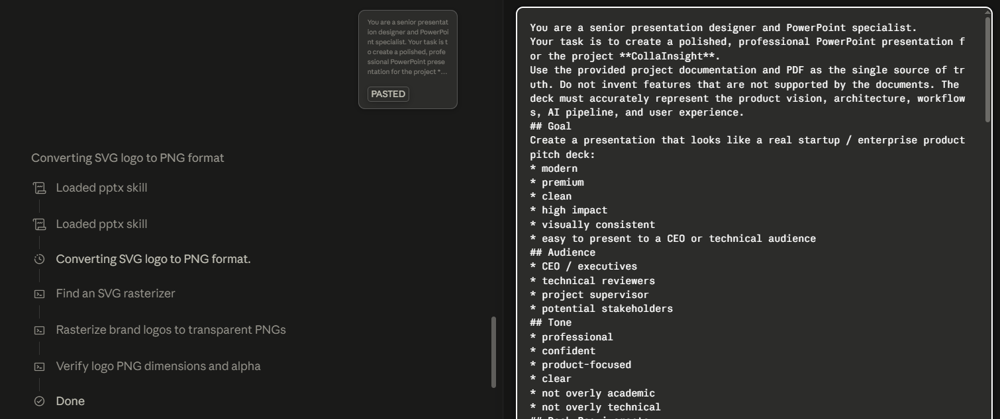

## Skills

Here I used the default skills of Claude to ensure if triggered it correctly or not. And these are the skills:

### 1 - XLSX Skill
- **Input**: Create a professional Excel workbook for my startup project "CollainSight". The workbook should include: 1. Project Roadmap - Phase - Description - Start Date - End Date - Status - Progress % 2. Feature Tracker - Feature Name - Priority - Assigned To - Status - Estimated Hours 3. Risk Assessment - Risk - Impact - Probability - Mitigation Plan 4. Budget Sheet - Category - Estimated Cost - Actual Cost - Variance - Formula-driven calculations 5. Dashboard - Charts summarizing project progress - Progress by phase - Budget utilization - Risk distribution Requirements: - Use proper Excel formatting. - Apply formulas where appropriate. - Create charts instead of static images. - Use conditional formatting for status and risk levels. - Organize each section into separate worksheets. - Deliver a production-ready .xlsx workbook.
- **Was the Skill Triggered?** Yes
- **Output** : Claude generated a structured Excel workbook with multiple worksheets, formulas, charts, and conditional formatting.
- **Observation**: The skill automatically selected spreadsheet-specific features that would not be practical in a normal text response.
- **Photos of some process:** 
  
  ### 2 - PDF Skill
- **Input**: As you using pdf skills, switch this mark down into pdf and design it and organize the information. *Also details information of what the content*.
- **Was the Skill Triggered?** Yes
- **Output** : Claude generated a structured PDF with style of color that I gave to it.
- **Observation**: The skill automatically selected PDF-specific features, but after its response, the layout of the PDF was not displayed correctly. So I told him to make it as A4 size to make it workable, then Claude made it correctly.
- **Photos of some process:** 
 
### 3 - PPTX Skill
- **Input**: You are a senior presentation designer and PowerPoint specialist. Your task is to create a polished, professional PowerPoint presentation for the project **CollaInsight**. etc...
- **Was the Skill Triggered?** Yes
- **Output** : Claude generated a structured PPTX with the color style I specified in previous messages about generating a PDF.
- **Observation**: The skill automatically selected presentation-specific features, and the PPTX is working correctly, displaying my `svg` logo and a simple animation.
- **Photos of some process:** 