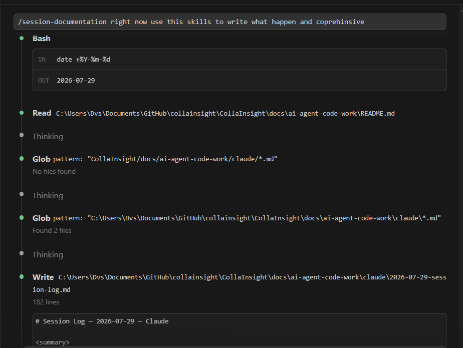

# Week 4 – Day 4

After completing the first version of my `session-documentation` skill, I integrated it into my project's `.claude/skills` directory and tested it during real project development sessions.

To verify the implementation, I invoked the skill using:

```text
/session-documentation right now use this skill to write what happened and comprehensive
```



The custom skill was successfully invoked and generated structured development session logs following the project's documentation conventions. Each generated log included:

- A concise session summary
- Detailed implementation progress
- Engineering decisions and rationale
- Open items for future work
- Files modified during the session

Rather than testing the skill with a small artificial example, I validated it as part of my actual development workflow. This confirmed that the skill consistently performed its intended task and could be reused throughout the project.

---

## Why this skill?

While developing the CollaInsight project (this is the new project inspired by the second week's project), I found that new AI coding sessions typically begin without access to previous conversation history. As a result, I repeatedly had to explain previous work and manually request development summaries in the project's preferred format.

To solve this problem, I created the `session-documentation` skill. It automatically generates structured session handover logs that preserve:

- implementation progress,
- engineering decisions,
- unresolved work,
- and modified files.

These logs become part of the repository itself, allowing future development sessions (or even different AI agents) to resume work from documented project history rather than relying on previous chat conversations.

This provides a lightweight continuity mechanism across independent AI sessions, making long-running software projects easier to maintain and continue over time.

## Evidence notes

> The generated session logs are included under `docs/ai-agent-code-work/claude/` as evidence that the custom skill was successfully integrated into a real development workflow. They demonstrate the skill operating consistently across multiple development sessions.