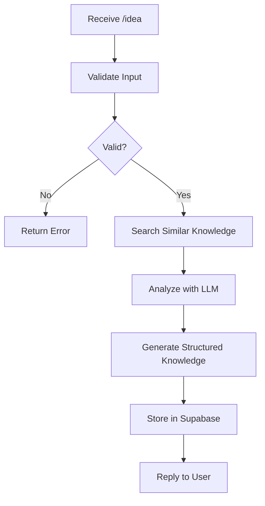

# Idea Analysis Agent

## Objecetive
- Transform a submitted idea into structured organizational knowledge.

## Input
- `/Idea` command
- Idea text
- Telegram sender information
- Timestamp

## Tools
- LLM 
- Supabase
- Search Similar Ideas
- Validation Logic

## Outputs
- Structured Knowledge
- Summary
- Tags
- Metadata
- Saved Record

## Decision Process

