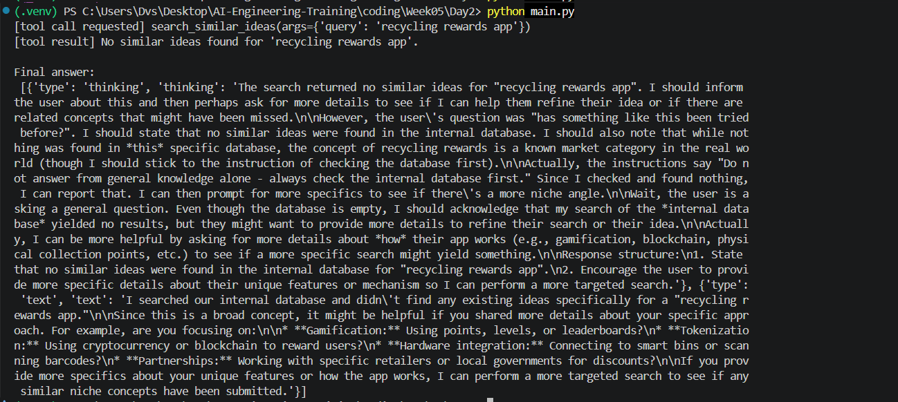

# Week 5 - Day 2

## Objective

Build a single-tool AI agent using LangChain.

## What was implemented

- Connected Gemini via LangChain
- Created the Search Similar Ideas tool
- Registered the tool with the LLM
- Implemented a manual tool-calling loop
- Queried the Supabase ideas table

## Current Limitations

- Only one tool is implemented.
- No memory yet.
- No planning.
- No guardrails.

These features will be added in the following days.

## Challenges & Lessons Learned

- **Editor didn't recognize installed packages**: the code editor was pointing at the wrong Python environment. Fixed by selecting the correct one.
- **The AI answered from its own general knowledge instead of searching**: at first, the model skipped the tool and just guessed an answer. Fixed by writing clearer instructions telling it to always check the database first.
- **A network problem blocked the database connection**: a security certificate error stopped the app from reaching the database. It turned out the current network was inspecting internet traffic in a way the app didn't trust. Fixed by connecting from a different network.
- **A few small code mistakes**: a typo that accidentally merged two words together, and a database query referencing a column that didn't exist. Both were caught by reading the error messages and testing the code step by step.
- **A search limitation we accepted for now**: simple keyword search only finds exact matching words, so slightly different wording (e.g. "app" vs "program") won't match even if the ideas are similar. This is a known trade-off of keyword search, not a bug - a future improvement could use smarter (semantic) search instead.

## Design Decisions

- We did not use `create_agent()` because it hides the internal tool-calling loop. For learning purposes, we implemented the loop manually to understand how the LLM decides to call a tool, how the tool executes, and how the result is returned back to the model.
- We did not use `init_chat_model()` / `init_chat_llm()` because this project only targets Google Gemini. Instead, we instantiated `ChatGoogleGenerativeAI` directly from the Google integration package, avoiding LangChain's provider-agnostic wrapper and keeping the code simpler.

## Result

Terminal output from running the script, showing the tool being called and the LLM using its result in the final answer:

