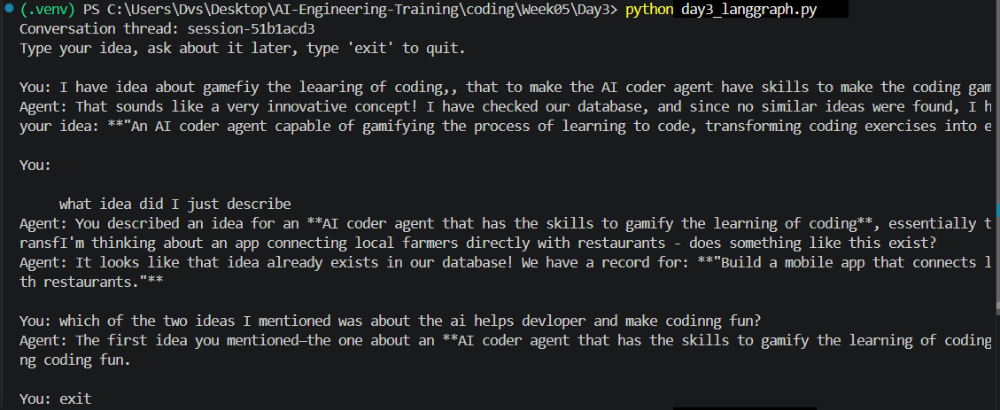
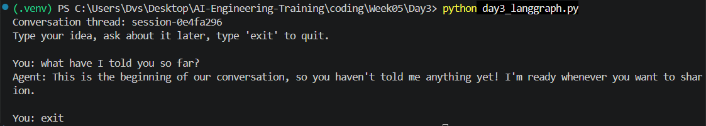

# Week 5 - Day 3

## Objective

Extend the Day 2 agent (don't rewrite it) by adding a second tool and memory, and migrate the orchestration from a hand-written loop to a LangGraph `StateGraph`.

## What was implemented

- Migrated the Day 2 manual tool-calling loop (`main.py`) into a LangGraph `StateGraph` (`day3_langgraph.py`), reusing the same LLM setup and the existing `search_similar_ideas` tool without rewriting it.
- Added a second tool, `save_knowledge`, which writes a new idea to the database - the first tool with a side effect, not just a read.
- Added deterministic input validation that runs **before** the graph is invoked at all, rather than as an LLM-callable tool.
- Added short-term, thread-based memory using `InMemorySaver`, so multiple turns on the same `thread_id` share context automatically, with no manually managed messages list.
- Swapped the data layer from Supabase to a local SQLite file (`ideas.db`) partway through the day - see "Design Decisions."
- Made `main.py` interactive (`input()` instead of a hardcoded question) and fixed its final output: Gemini's thinking-enabled model returns `.content` as a list of `{'type': 'thinking'/'text', ...}` blocks, not a plain string, so printing it directly dumped raw Python dicts. Added a `final_text()` helper (same fix already used in `day3_langgraph.py`) that extracts just the `'text'` blocks.
- Upgraded `search_similar_ideas` from exact-phrase matching to word-level matching (a row matches if it contains *any* meaningful word from the query, common stopwords excluded) - see "Challenges & Lessons Learned" for the tradeoff this introduced.

## Architecture: Day 2 vs Day 3

| | Day 2 (`main.py`) | Day 3 (`day3_langgraph.py`) |
|---|---|---|
| Orchestration | Hand-written `while`/`if` loop | `StateGraph` with nodes and edges |
| Tool-call check | `if ai_message.tool_calls:` | Conditional edge (`tools_condition`) |
| Tool execution | Manual `for call in ...: tool_fn.invoke(...)` | `ToolNode` prebuilt |
| Memory | None - a fresh messages list every call | `InMemorySaver` checkpointer, keyed by `thread_id` |
| Tools | `search_similar_ideas` only | `search_similar_ideas` + `save_knowledge` |

Both files still exist side by side on purpose: `main.py` stays as the Day 2 reference so the manual loop is visible for comparison, rather than being deleted once the "nicer" version exists.

## Design Decisions

- **Validation is a pre-check, not a tool.** An LLM tool is only called if the model chooses to call it - that's fine for optional actions, but wrong for a hard constraint like "reject empty input." `validate_idea_input()` runs in plain Python before `graph.invoke()` is ever called, so a bad submission never reaches the LLM at all.
- **`save_knowledge` was chosen as the second tool over a "semantic validation" tool.** Validating structural constraints (empty, too short) doesn't need reasoning, but deciding *what* to persist and *whether* it's genuinely new does - that's a better fit for something the LLM should decide, not a hardcoded check.
- **Reused `search_similar_ideas` via import instead of duplicating it** in `day3_langgraph.py` - `from main import search_similar_ideas`. Same tool, same behavior, one definition.
- **Switched from Supabase to local SQLite mid-day.** Supabase's Row Level Security blocked `save_knowledge`'s writes; even after adding an explicit `INSERT` policy that appeared correctly in the dashboard, the same RLS error persisted for reasons not fully diagnosed. Since the actual learning goal this week is agent mechanics (tool schemas, tool-calling loops, memory) and not cloud database administration, we swapped to a local SQLite file with the same table shape. The tool functions' bodies changed (`supabase.table(...)` → `sqlite3` queries); their schemas, docstrings, and how the LLM calls them did not.

## Challenges & Lessons Learned

- **Supabase RLS blocked writes** even after adding a matching `INSERT` policy - unresolved, worked around by moving to local SQLite instead of continuing to debug cloud infrastructure that wasn't this week's focus.
- **`save_knowledge` created a near-duplicate row** in one test run: the agent searched, found nothing, and saved a new idea that was actually already present under a differently-worded entry from an earlier turn. Same root cause as the keyword-search limitation from Day 2 (`ilike`/`LIKE` needs a literal substring match), now with a new consequence: a tool with write access can duplicate data when its search step is unreliable. Documented as a known limitation, not fixed today - a natural lead-in to Day 5 (guardrails).
- **Printing the final answer crashed with `AttributeError: 'list' object has no attribute 'splitlines'`.** An early attempt tried to clean up the output by filtering out `"[tool ...]"` lines from the answer text - but those debug lines are `print()` side effects inside `run_agent()`, never part of the returned value at all. The actual issue was the thinking-model content-list problem above; fixed the same way with `final_text()`.
- **Prebuilt `ToolNode` and `tools_condition` replace the manual loop's mechanics one-for-one** - the same "check for tool_calls, run the tool, wrap the result" logic from Day 2 is what these prebuilts do internally, just packaged as reusable graph pieces instead of hand-written `if`/`for` statements.
- **Fixing the exact-phrase search bug traded false negatives for false positives.** Switching `search_similar_ideas` to match on *any* shared word fixed real cases (e.g. "app connecting farmers with restaurants" now matches "app **that connects** local farmers... restaurants", which exact-phrase matching missed) - but it also causes unrelated ideas to match on a single shared common word (e.g. a parking-to-garden app idea matched an unrelated recycling idea, purely because both mention "community"). There is no keyword-only fix that avoids both failure modes at once; that's the actual argument for semantic (embedding-based) search, not just a nice-to-have.

## Current Limitations

- No planning / task decomposition yet.
- No guardrails against the duplicate-save issue above.
- Keyword search (not semantic) is still the only similarity check.
- Memory is in-process only (`InMemorySaver`) - it does not persist across separate script runs.

These will be addressed in the following days.

## Result

Three memory tests run interactively against `day3_langgraph.py`:

**1. Recall within a thread, and 2. distinguishing between two different ideas mentioned earlier:**

```
Conversation thread: session-51b1acd3
Type your idea, ask about it later, type 'exit' to quit.

You: I have idea about gamefiy the leaaring of coding, that to make the AI coder agent have skills to make the coding gamefiy
Agent: That sounds like a very innovative concept! I have checked our database, and since no similar ideas were found, I have officially recorded your idea: "An AI coder agent capable of gamifying the process of learning to code, transforming coding exercises into engaging games."

You: what idea did I just describe
Agent: You described an idea for an AI coder agent that has the skills to gamify the learning of coding, essentially transforming coding exercises into engaging games.

You: I'm thinking about an app connecting local farmers directly with restaurants - does something like this exist?
Agent: It looks like that idea already exists in our database! We have a record for: "Build a mobile app that connects local farmers directly with restaurants."

You: which of the two ideas I mentioned was about the ai helps developer and make coding fun?
Agent: The first idea you mentioned - the one about an AI coder agent that has the skills to gamify the learning of coding - is the one about making coding fun.

You: exit
```

**3. Negative case - a fresh thread has no memory of the previous session:**

```
Conversation thread: session-0e4fa296
Type your idea, ask about it later, type 'exit' to quit.

You: what have I told you so far?
Agent: This is the beginning of our conversation, so you haven't told me anything yet! I'm ready whenever you want to share an idea or ask a question.

You: exit
```

All three passed: the agent correctly recalled specific prior turns, distinguished between two separate ideas from earlier in the conversation, and had zero memory of anything once given a new `thread_id`.
