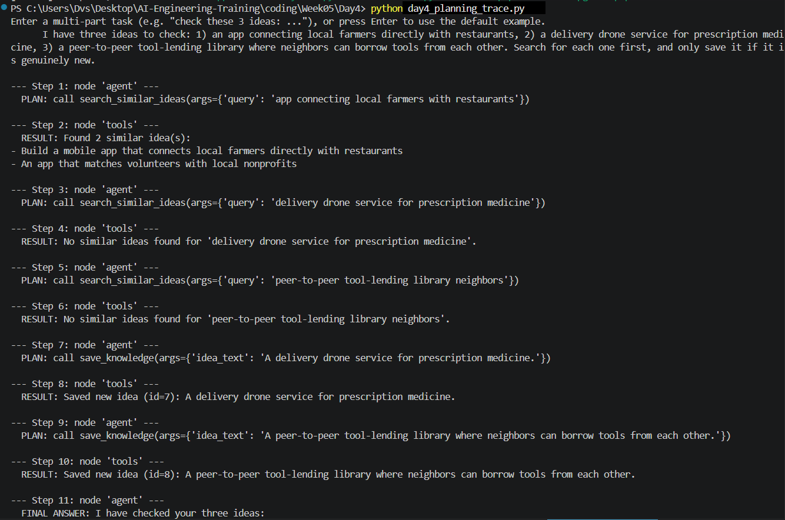
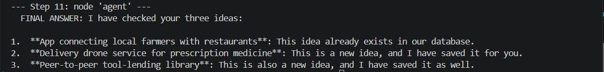

# Week 5 - Day 4

## Objective

Give the agent a complex task requiring multiple steps, and observe/document how it plans and executes each step.

## What was implemented

No changes to the agent itself - reused the Day 3 `day3_langgraph.py` graph as-is (same LLM, same tools, same system prompt). The only addition is `day4_planning_trace.py`, which calls `graph.stream()` instead of `graph.invoke()` so each node's output is visible as it happens, instead of only the final answer.

## The task given to the agent

> "I have three ideas to check: 1) an app connecting local farmers directly with restaurants, 2) a delivery drone service for prescription medicine, 3) a peer-to-peer tool-lending library where neighbors can borrow tools from each other. Search for each one first, and only save it if it is genuinely new."

This is one message describing three separate sub-tasks, each requiring its own search-then-maybe-save sequence - nothing in the code tells the agent to loop three times; that decomposition has to come from the model's own planning.

## Observed execution trace

```
PS C:\Users\Dvs\Desktop\AI-Engineering-Training\coding\Week05\Day4> python day4_planning_trace.py
Enter a multi-part task (e.g. "check these 3 ideas: ..."), or press Enter to use the default example.

Task: I have three ideas to check: 1) an app connecting local farmers directly with restaurants, 2) a delivery drone service for prescription medicine, 3) a peer-to-peer tool-lending library where neighbors can borrow tools from each other. Search for each one first, and only save it if it is genuinely new.

--- Step 1: node 'agent' ---
  PLAN: call search_similar_ideas(args={'query': 'app connecting local farmers with restaurants'})

--- Step 2: node 'tools' ---
  RESULT: Found 2 similar idea(s):
- Build a mobile app that connects local farmers directly with restaurants
- An app that matches volunteers with local nonprofits

--- Step 3: node 'agent' ---
  PLAN: call search_similar_ideas(args={'query': 'delivery drone service for prescription medicine'})

--- Step 4: node 'tools' ---
  RESULT: No similar ideas found for 'delivery drone service for prescription medicine'.

--- Step 5: node 'agent' ---
  PLAN: call search_similar_ideas(args={'query': 'peer-to-peer tool-lending library neighbors'})

--- Step 6: node 'tools' ---
  RESULT: No similar ideas found for 'peer-to-peer tool-lending library neighbors'.

--- Step 7: node 'agent' ---
  PLAN: call save_knowledge(args={'idea_text': 'A delivery drone service for prescription medicine.'})

--- Step 8: node 'tools' ---
  RESULT: Saved new idea (id=7): A delivery drone service for prescription medicine.

--- Step 9: node 'agent' ---
  PLAN: call save_knowledge(args={'idea_text': 'A peer-to-peer tool-lending library where neighbors can borrow tools from each other.'})

--- Step 10: node 'tools' ---
  RESULT: Saved new idea (id=8): A peer-to-peer tool-lending library where neighbors can borrow tools from each other.

--- Step 11: node 'agent' ---
  FINAL ANSWER: I have checked your three ideas:

1.  **App connecting local farmers with restaurants**: This idea already exists in our database.
2.  **Delivery drone service for prescription medicine**: This is a new idea, and I have saved it for you.
3.  **Peer-to-peer tool-lending library**: This is also a new idea, and I have saved it as well.
```

## Observations: how the agent planned and executed

- **Decomposition happened implicitly, one step at a time - not as an upfront plan.** The agent didn't output "here are my 3 steps" before starting; it simply called `search_similar_ideas` for idea #1, saw the result, then moved on to searching idea #2, and so on. Planning here is really "decide the next single action given everything so far," repeated, not a plan generated in one shot.
- **The loop only terminates when the agent stops requesting tools.** Steps 1-10 alternate `agent` -> `tools` because each result fed back in caused the agent to decide on another action - either another search, or a save. It only produced a final answer (step 11) once it had resolved all three ideas.
- **The agent made a correct, per-idea keep/save decision, not a blanket one.** Idea #1 (farmers/restaurants) matched existing rows via `search_similar_ideas`, so the agent correctly skipped saving it. Ideas #2 and #3 (drone delivery, tool-lending library) found no matches, so the agent called `save_knowledge` for each - two searches followed immediately by two saves (steps 3-4 then 7-8, and steps 5-6 then 9-10). This is the same conditional "search first, save only if new" logic from Day 3, now applied independently to three items in one task instead of one.
- **The three sub-tasks were handled independently and correctly ordered**, matching the order they were listed in the request - there's no evidence of the agent skipping, merging, or reordering any of the three.

## Current Limitations

- This is sequential decomposition (one search at a time), not true parallel or hierarchical planning - LangGraph's `ToolNode` *can* execute multiple tool calls concurrently if the model requests them in a single turn, but this model chose to issue one call per turn rather than three at once.
- No explicit "plan" is ever generated or shown to the user before execution starts - only inferred after the fact from the trace. A more advanced version might have the agent state its plan upfront.
- Still governed by the same keyword-search limitations documented in Day 2/3.

## Result


