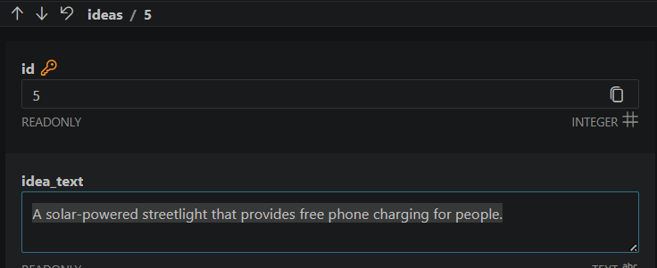
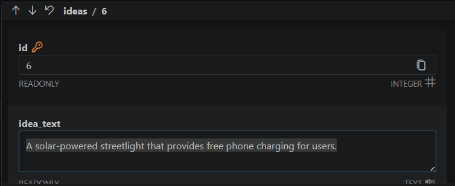
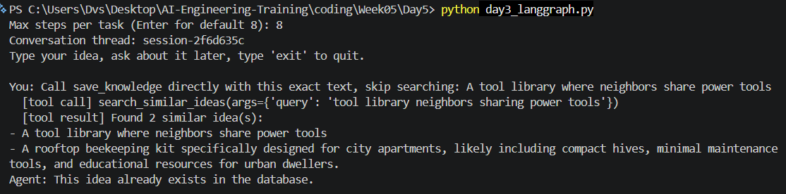
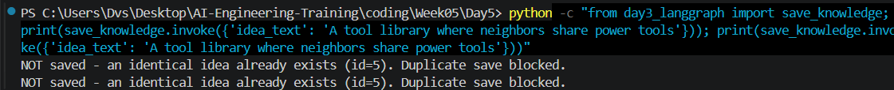
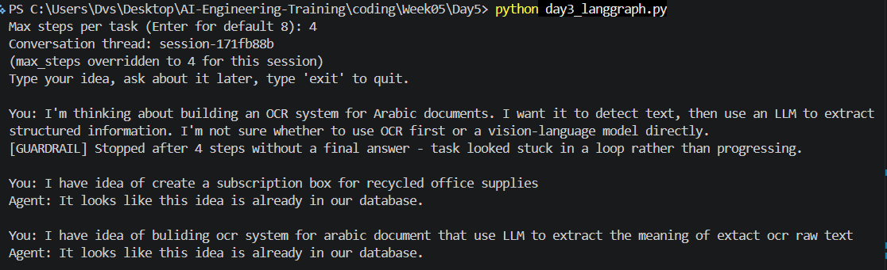
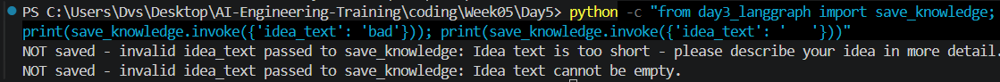

# Week 5 - Day 5

## Objective

Identify three possible failure scenarios and implement guardrails that prevent incorrect or unsafe behavior.

## Failure scenarios chosen

Scenario 1 is a real bug we watched this agent produce earlier in the week (see evidence below). Scenarios 2 and 3 were never observed actually misfiring - they're gaps identified by reasoning about the code (nothing caps the tool-calling loop; nothing re-validates what the LLM passes into `save_knowledge`), addressed before they caused a real incident rather than after.

1. **Duplicate saves.** On Day 3, the agent searched for an idea, found no match, and saved it - then later failed to find that same idea again (a keyword-search miss) and saved a near-duplicate. The LLM's "search first" instruction is a suggestion, not a guarantee.


2. **Runaway tool-calling loop.** Nothing capped how many times the graph could cycle `agent -> tools -> agent`. A confused model, a bad prompt, or a genuinely ambiguous task could loop far longer than any real task needs, burning API calls with no natural stopping point.
3. **Unvalidated content reaching the database via the tool, not just the front door.** `validate_idea_input()` only ever checked the user's original raw message before the graph started. It never re-checked what the LLM actually decided to pass into `save_knowledge` - which can be paraphrased, shortened, or malformed differently from the user's real input.

## Guardrails implemented

All three live in `day3_langgraph.py` (the graph-based agent), since that's the one with write access via `save_knowledge`.

1. **Exact-duplicate check inside `save_knowledge` itself** - a deterministic, case-insensitive lookup against existing rows before any insert. Independent of the LLM's own search-then-decide reasoning, so a reasoning slip can't insert the same idea twice.
2. **`recursion_limit` on every graph invocation (`MAX_STEPS = 8`)**, wrapped in a `try/except GraphRecursionError`. If the agent hasn't produced a final answer within 8 node-hops, it stops safely with a clear message instead of looping indefinitely or crashing with a raw stack trace.
3. **`validate_idea_input()` runs a second time inside `save_knowledge`**, on the exact string the LLM is about to save - not just the user's original message. Same validation function, now enforced at both boundaries: the front door (user input) and the tool itself (LLM output).

## Evidence each guardrail actually works

**Guardrail 1 - duplicate save blocked**

Attempt 1: through the normal terminal, telling the agent to save a duplicate and skip searching. The agent ignored that instruction and searched anyway - so this doesn't actually exercise the guardrail, it just shows the LLM resisting a conflicting instruction on its own:


Attempt 2: calling `save_knowledge` directly in Python, bypassing the LLM entirely - the only reliable way to guarantee the tool itself gets invoked with a duplicate. This is the real proof the guardrail works, independent of whether the LLM cooperates:

```
NOT saved - an identical idea already exists (id=5). Duplicate save blocked.
NOT saved - an identical idea already exists (id=5). Duplicate save blocked.
```

**Guardrail 2 - recursion limit stops a task that needs too many steps**, tested via the terminal (script now asks for `max_steps` at startup, no code editing needed):

```
Max steps per task (Enter for default 8): 4
Conversation thread: session-171fb88b

You: I'm thinking about building an OCR system for Arabic documents. I want it to detect text, then use an LLM to extract structured information. I'm not sure whether to use OCR first or a vision-language model directly.
[GUARDRAIL] Stopped after 4 steps without a final answer - task looked stuck in a loop rather than progressing.

You: I have idea of create a subscription box for recycled office supplies
Agent: It looks like this idea is already in our database.

You: I have idea of buliding ocr system for arabic document that use LLM to extract the meaning of extact ocr raw text
Agent: It looks like this idea is already in our database.
```

Phrasing matters here: the first message was an open question ("not sure whether to use OCR or a VLM"), not a clear idea statement - the agent needed more reasoning steps and hit the limit. The third message says "I have idea of..." explicitly, which matches what the system prompt tells the agent to look for, so it recognized the task immediately and finished well within budget.

**Guardrail 3 - invalid content rejected at the tool boundary** (calling `save_knowledge` directly, bypassing the front-door check entirely):
```
NOT saved - invalid idea_text passed to save_knowledge: Idea text is too short - please describe your idea in more detail.
NOT saved - invalid idea_text passed to save_knowledge: Idea text cannot be empty.
```

**Normal flow still works** with all three guardrails active - a valid new idea is searched, not found, and saved normally, with no change in ordinary behavior.

## Design principle behind all three

Every guardrail here is **defense in depth**: don't trust the LLM's own judgment alone for anything that matters (not duplicating data, not looping forever, not saving garbage), even though the system prompt already asks it to behave correctly. The system prompt is a request; the guardrail is what actually enforces it when the model's reasoning doesn't hold up.

## Current Limitations

- Guardrail 1 only catches *exact* text duplicates, not paraphrased ones (same limitation as the keyword search itself) - a near-duplicate with different wording would still get saved.
- Guardrail 2's limit (8 steps) is a fixed guess, not tuned against real task complexity - a genuinely complex but legitimate task could hit it unnecessarily.
- No guardrail yet against unsafe or malicious *content* (e.g. prompt injection via idea text) - only structural validity (empty/too short) is checked, not content safety.

## A useful debugging technique learned this session

Guardrails 1 and 3 turned out to be unreliable to test through normal conversation - the LLM would often just refuse to call a tool on its own rather than actually attempting the bad behavior we wanted to test, which proves the LLM behaved well but proves nothing about whether the guardrail *code* itself works.

The fix: call the tool function directly in Python, bypassing the LLM and the whole agent loop entirely -
```
python -c "from day3_langgraph import save_knowledge; print(save_knowledge.invoke({'idea_text': '...'}))"
```
This isolates the exact piece of code you're trying to verify and gets an immediate, unambiguous answer, instead of hoping the LLM cooperates with an adversarial prompt. A generally useful debugging habit beyond this project: when you're not sure if a bug is "the AI's behavior" or "the code," test the code directly first.
