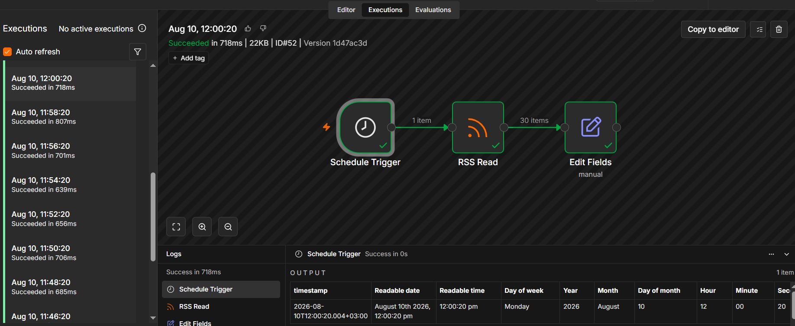

# Day 1 — Automation Foundations & Introduction to n8n

## Objective

Build an n8n workflow that runs automatically on a schedule and performs at least two connected actions.

## Workflow

```text
Schedule Trigger
       ↓
RSS Feed Read
       ↓
Edit Fields
```

The workflow runs every 2 minutes, retrieves technical news from the Hacker News RSS feed, and extracts selected fields from the RSS data.

## Concepts Demonstrated

* Scheduled workflow execution
* n8n triggers and nodes
* RSS data retrieval
* Data transformation with Edit Fields
* Automatic background execution

## Evidence

The workflow was activated and successfully executed automatically according to the configured schedule.



## Workflow Export

The complete n8n workflow is available in:

`day-1-scheduled-workflow.json`
