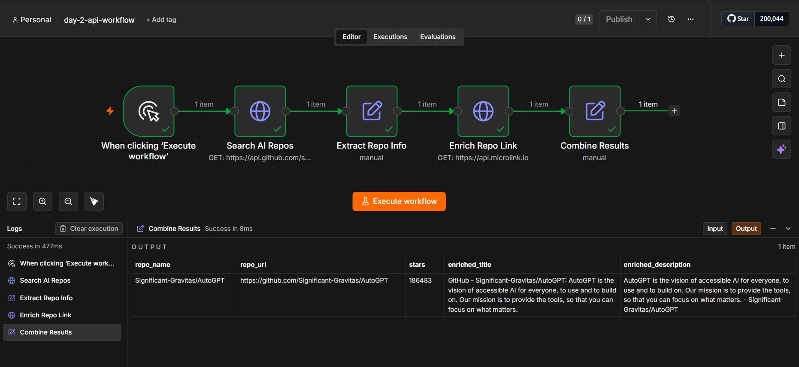

# Day 2 — Connecting Tools & APIs in n8n

## Objective

Connect two external APIs inside n8n and exchange data between them successfully.

## Workflow

```text
Manual Trigger
      ↓
Search AI Repos (GitHub REST API)
      ↓
Extract Repo Info
      ↓
Enrich Repo Link (Microlink API)
      ↓
Combine Results
```

**API 1 — GitHub REST API** (`api.github.com/search/repositories`): searches for AI/ML repositories sorted by stars, returns repo name, URL, star count, and description.

**API 2 — Microlink API** (`api.microlink.io`): given a URL, returns page metadata (title, description, image).

## The Data Exchange

`Enrich Repo Link`'s request URL is built from API 1's output — specifically `repo_url` extracted from the top GitHub search result. Without API 1 running first, API 2 has no input to work with. `Combine Results` then merges fields from both API responses (`repo_name`/`stars` from GitHub, `enriched_title`/`enriched_description` from Microlink) into a single record, referencing the earlier `Extract Repo Info` node directly by name (`$('Extract Repo Info').item.json...`).

## Concepts Demonstrated

* API integration with two distinct real-world REST APIs (no API keys required)
* HTTP requests via the HTTP Request node
* Node-based automation
* Passing data between nodes, including reaching back to a non-adjacent earlier node by name

## Evidence

Workflow executed successfully end to end. Final output confirms both APIs' data merged into one record for the top AI repo (`Significant-Gravitas/AutoGPT`, 186,483 stars), enriched with metadata scraped from the repo's actual GitHub page.



## Workflow Export

The complete n8n workflow is available in:

`day-2-api-workflow.json`
