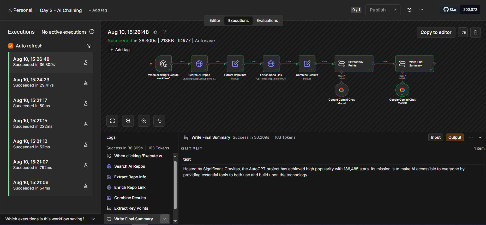

# Day 3 — AI Workflows & Chaining Agents

## Objective

Create an AI workflow where multiple LLM steps process data sequentially before producing a final output.

## Workflow

```text
Manual Trigger
      ↓
Search AI Repos (GitHub REST API)
      ↓
Extract Repo Info
      ↓
Enrich Repo Link (Microlink API)
      ↓
Combine Results
      ↓
Extract Key Points   (Basic LLM Chain — Google Gemini)
      ↓
Write Final Summary  (Basic LLM Chain — Google Gemini)
```

This extends Day 2's working API-integration pipeline rather than introducing a new data source — the `Combine Results` output (`repo_name`, `stars`, `enriched_description`) becomes the input to the LLM chain.

## The Sequential Chain

Two separate `Basic LLM Chain` nodes, each with its own `Google Gemini Chat Model` sub-node:

1. **Extract Key Points** — prompted with the repo's name, star count, and enriched description; returns a short bullet list of key facts.
2. **Write Final Summary** — prompted with `{{ $json.text }}`, which resolves to **Extract Key Points' generated output** (not the original repo data), and produces a polished 2-sentence summary.

Step 2 depends entirely on Step 1's result — it has no direct connection to `Combine Results` and cannot run meaningfully without Step 1 executing first. This is what makes it genuine sequential chaining rather than two independent LLM calls sharing the same input.

## Concepts Demonstrated

* n8n native AI/LLM nodes (`Basic LLM Chain` + `Google Gemini Chat Model`), not a generic HTTP call and not an AI Agent
* Sequential processing — second LLM step consumes the first step's output
* LLM chaining
* AI workflow orchestration built on top of an existing, working API-integration pipeline

## Evidence

Full 7-node pipeline (plus 2 attached Gemini model sub-nodes) executed successfully — Execution ID#77, succeeded in 36.3s, 163 tokens used (confirming real API calls, not mocked). Final output for the top AI repo (`Significant-Gravitas/AutoGPT`):

> "Hosted by Significant-Gravitas, the AutoGPT project has achieved high popularity with 186,485 stars. Its mission is to make AI accessible to everyone by providing essential tools to both use and build on."



## Workflow Export

The complete n8n workflow is available in:

`day-3-ai-chaining.json`

Note: the exported JSON references the Gemini credential by name/ID only (`Google Gemini(PaLM) Api account`) — the actual API key is stored in n8n's own encrypted credential store and is never present in this file.
