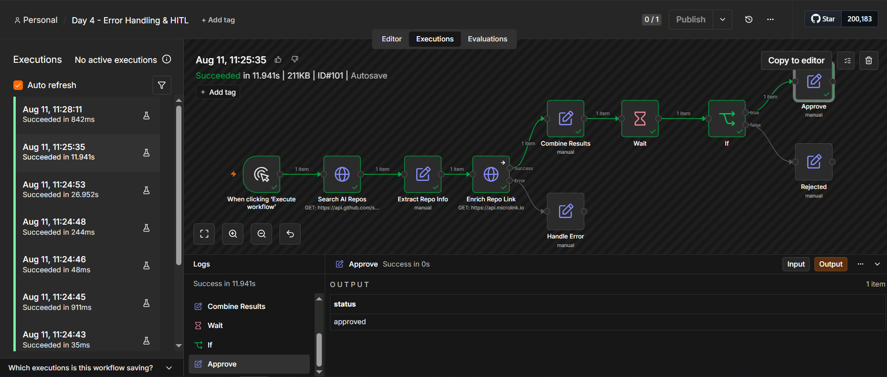
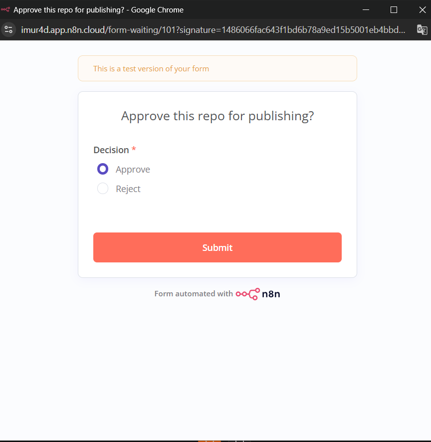
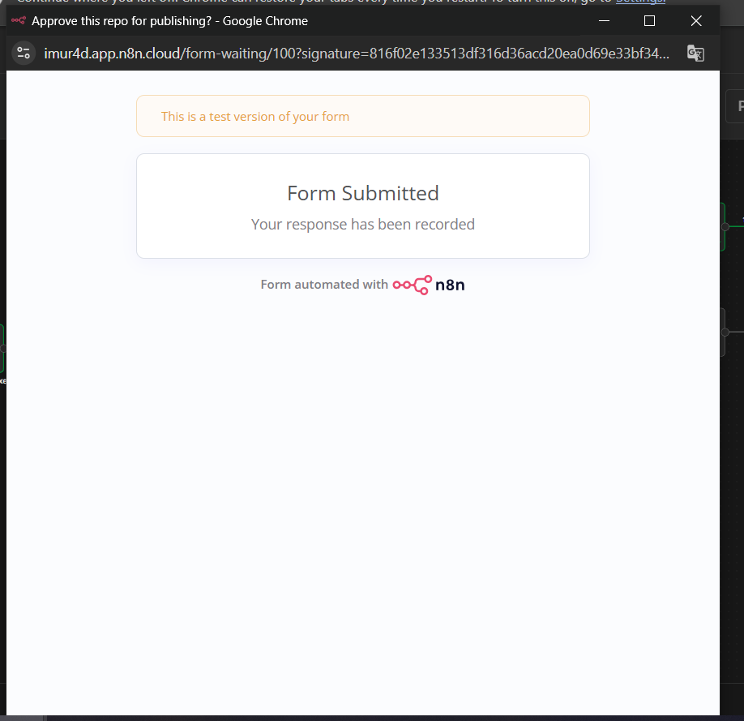
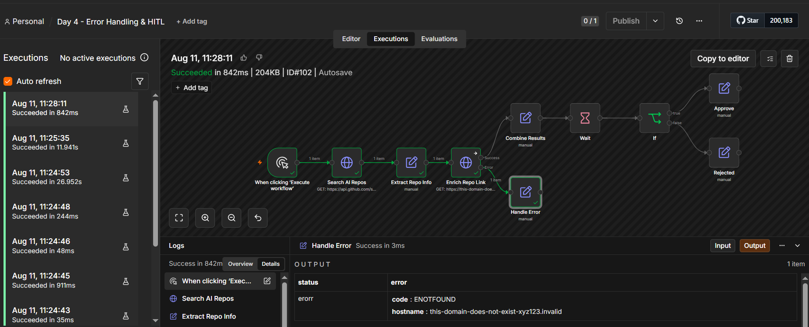

# Day 4 — Error Handling & Human-in-the-Loop

## Objective

Add error handling and a human approval step to an existing workflow, then test both success and failure scenarios.

## Workflow

```text
Manual Trigger → Search AI Repos → Extract Repo Info → Enrich Repo Link → Combine Results
                                                              ↓ (error)         ↓
                                                         Handle Error         Wait (human approval form)
                                                                                ↓
                                                                    If (Decision == Approve?)
                                                                    ↓                    ↓
                                                                Approve               Rejected
```

Extends Day 2's pipeline with two additions: node-level error handling on `Enrich Repo Link`, and a human approval checkpoint before the workflow finalizes.

## Error Handling

`Enrich Repo Link` is configured with **On Error: Continue (using error output)** (`"onError": "continueErrorOutput"` in the node settings). This gives the node two separate output branches instead of one:

* **Success branch** → `Combine Results` → proceeds to human approval
* **Error branch** → `Handle Error` → captures `error.code` and `error.hostname` into a clean structured record instead of crashing the workflow

n8n's dedicated Error Trigger / Error Workflow feature was deliberately **not** used — n8n's own docs confirm it cannot be tested via manual execution ("The Error Trigger only runs when an automatic workflow errors"), which would have made it untestable given this workflow uses a Manual Trigger. Node-level `On Error` handling achieves the same goal (graceful failure recovery) and is fully testable on demand.

## Human-in-the-Loop

A **Wait** node (resume condition: **On Form Submitted**) pauses the workflow after `Combine Results` and generates a live approval form ("Approve this repo for publishing?" with an Approve/Reject choice). Execution only continues once a human actually submits the form. An **If** node then branches on the submitted `Decision` field into `Approve` or `Rejected` outcomes.

## Concepts Demonstrated

* Node-level error handling / failure recovery (`Continue using error output`)
* Human-in-the-loop approval via a live, interactive form
* Approval/checkpoint step that genuinely blocks execution until a human acts
* Testing both success and failure as real, separate executions

## Evidence

**Success scenario** — Execution #101, succeeded in 11.9s. Full pipeline ran, human approved via the live form, final output `{ status: "approved" }`.





**Failure scenario** — Execution #102, `Enrich Repo Link`'s URL was temporarily pointed at a non-existent domain to force a real DNS failure (`ENOTFOUND`). The error was caught by the error-output branch and handled gracefully by `Handle Error`, rather than crashing the workflow.



The workflow was reverted to its working URL (`https://api.microlink.io`) after the failure test — the exported JSON reflects the working, non-broken state.

## Workflow Export

The complete n8n workflow is available in:

`day-4-error-hitl.json`
