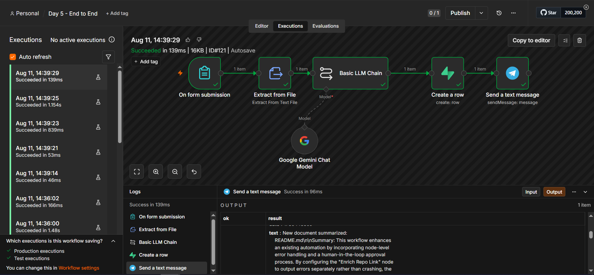
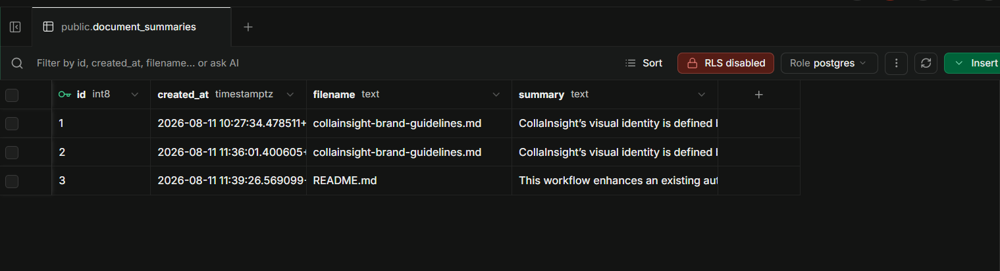
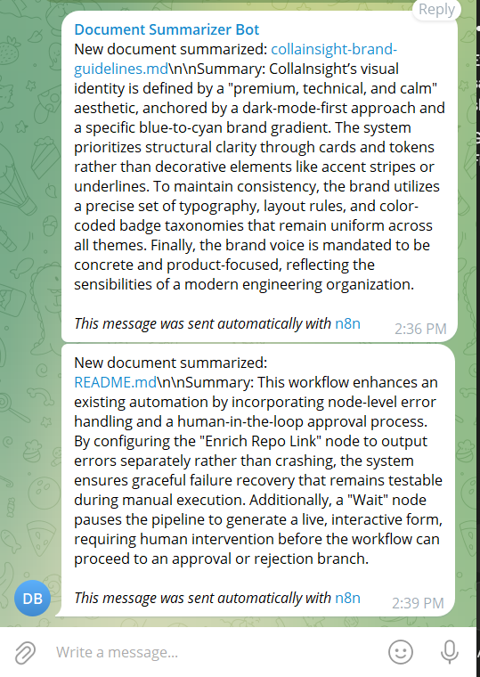

# Day 5 — End-to-End Automation

## Objective

Build an end-to-end n8n automation that receives a document, summarizes it using AI, stores the result, and sends a notification.

## Workflow

```text
On form submission (file upload)
      ↓
Extract from File (Extract From Text File)
      ↓
Basic LLM Chain (Google Gemini) — summarize
      ↓
Create a row (Supabase — document_summaries table)
      ↓
Send a text message (Telegram — private group)
```

A real webhook-based trigger (Form Trigger), not a manual click — matching how a document would actually arrive in a working automation.

## The Four Required Steps

1. **Receives a document** — Form Trigger with a file-upload field. Tested with two different real `.md` files (`collainsight-brand-guidelines.md`, `README.md`).
2. **Summarizes it using AI** — extracted text is passed to a `Basic LLM Chain` node backed by Google Gemini, producing a 3-4 sentence summary genuinely derived from each document's actual content.
3. **Stores the result** — a Supabase `Create a row` node inserts `filename` and `summary` into a `document_summaries` table (RLS disabled, accessed via the service-role-equivalent Secret Key, sidestepping the RLS blocker hit with Supabase in Week 5).
4. **Sends a notification** — a Telegram node posts the summary to a private group created for this test, using the bot's Access Token credential.

## Credential & Secret Handling

* Gemini and Telegram credentials are stored only in n8n's encrypted credential store — never present in the exported JSON (only credential name/ID references).
* The Supabase Secret Key is likewise stored only as an n8n credential.
* The Telegram group **Chat ID** is not a traditional secret (it grants no access without the bot's Access Token), but to keep the exported workflow clean for this public repo, the real ID was replaced with the placeholder `"yourchatid"` after testing and before committing.

## Evidence

Two full real executions, both succeeding end to end:

| Document | Execution | Result |
|---|---|---|
| `collainsight-brand-guidelines.md` | 14:36 | Summarized, stored, notified |
| `README.md` (Day 4's own README) | 14:39 (Execution #121) | Summarized, stored, notified |

**n8n execution** — all 6 nodes green, final Telegram send confirmed successful:



**Supabase storage** — both documents' summaries persisted as real rows in `document_summaries`:



**Telegram notification** — both messages received in the private test group, timestamps matching the n8n execution log exactly:



## Workflow Export

The complete n8n workflow is available in:

`day-5-end-to-end.json`

Note: the Telegram `chatId` field contains a placeholder value, not the real group ID — see Credential & Secret Handling above.
